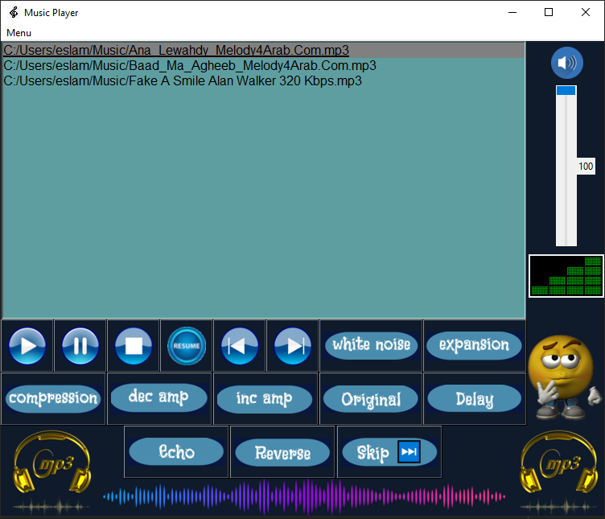

# <h1 align="center">🎵 Tkinter Music Player with Audio Effects</h1> 

A desktop-based music player built using **Tkinter**, **Pygame**, and **Librosa**, featuring advanced audio transformations like pitch shifting, white noise addition, echo, time stretching, and waveform visualization.



---

## 🚀 Features

- 🎧 Play, pause, resume, stop, skip, and delay songs
- 🔊 Volume control with dynamic volume icons
- 🌀 Audio effects:
  - Add white noise
  - Time compression & expansion (change speed)
  - Pitch shifting (amplitude up/down)
  - Echo effect
  - Reverse audio
- 📈 Real-time waveform plots using Matplotlib
- 📁 Add/remove songs from playlist
- 🎨 Custom GUI with images and styled buttons

---

## 🛠 Requirements

Install dependencies with:

```bash
pip install -r requirements.txt
